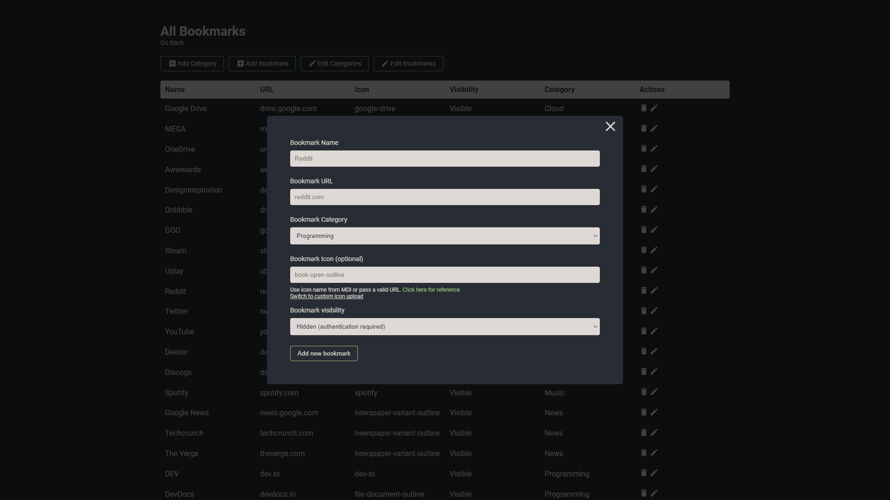
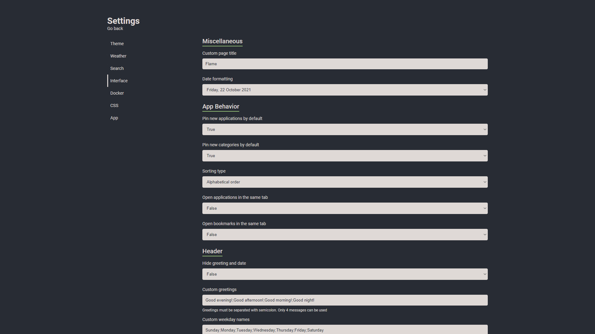

# Glame


## Glame description

Glame is a lightweight server port (without Docker and Kubernetes integration yet) implemented in Golang. Glame is fully used by the [Flame](https://github.com/pawelmalak/flame) client.

Comparison of resource consumption
| | RAM | Docker size |
| ----- | ----- | ----------- |
| Glame | 10MB | 8MB |
| Flame | 130MB | 60MV |

## Original description

[Flame](https://github.com/pawelmalak/flame) is self-hosted startpage for your server. Its design is inspired (heavily) by [SUI](https://github.com/jeroenpardon/sui). Flame is very easy to setup and use. With built-in editors, it allows you to setup your very own application hub in no time - no file editing necessary.

## Functionality

- 📝 Create, update, delete your applications and bookmarks directly from the app using built-in GUI editors
- 📌 Pin your favourite items to the homescreen for quick and easy access
- 🔍 Integrated search bar with local filtering, 11 web search providers and ability to add your own
- 🔑 Authentication system to protect your settings, apps and bookmarks
- 🔨 Dozens of options to customize Flame interface to your needs, including support for custom CSS, 15 built-in color themes and custom theme builder
- ☀️ Weather widget with current temperature, cloud coverage and animated weather status
- ~~🐳 Docker integration to automatically pick and add apps based on their labels~~

## Migrate from Flame

Make a backup of the `data` directory and set the path to the docker command or in the `docker-compose.yml` file.

## Installation

[Docker Hub link](https://hub.docker.com/r/bzzim/glame)

```sh
docker pull bzzim/glame
```

#### Deployment

```sh
# run container
docker run -p 5006:5006 -v /path/to/data:/app/data -e PASSWORD=glame_password --name glame bzzim/glame
```

#### Building image

```sh
# build image for current arch
docker build -t glame  .
```

#### Docker-Compose

```yaml
version: '3.6'

services:
  glame:
    image: bzzim/glame
    container_name: glame
    volumes:
      - ./data:/app/data
    ports:
      - 5006:5006
    environment:
      - PASSWORD=glame_password
      - SECRET=optional_secret_auth_string
    restart: unless-stopped
```

## Screenshots







## Usage

### Authentication

Visit [project wiki](https://github.com/pawelmalak/flame/wiki/Authentication) to read more about authentication

### Search bar

#### Searching

The default search setting is to search through all your apps and bookmarks. If you want to search using specific search engine, you need to type your search query with selected prefix. For example, to search for "what is docker" using google search you would type: `/g what is docker`.

For list of supported search engines, shortcuts and more about searching functionality visit [project wiki](https://github.com/pawelmalak/flame/wiki/Search-bar).

### Setting up weather module

1. Obtain API Key from [Weather API](https://www.weatherapi.com/pricing.aspx).
   > Free plan allows for 1M calls per month. Flame is making less then 3K API calls per month.
2. Get lat/long for your location. You can get them from [latlong.net](https://www.latlong.net/convert-address-to-lat-long.html).
3. Enter and save data. Weather widget will now update and should be visible on Home page.

### Custom CSS and themes

See project wiki for [Custom CSS](https://github.com/pawelmalak/flame/wiki/Custom-CSS) and [Custom theme with CSS](https://github.com/pawelmalak/flame/wiki/Custom-theme-with-CSS).
